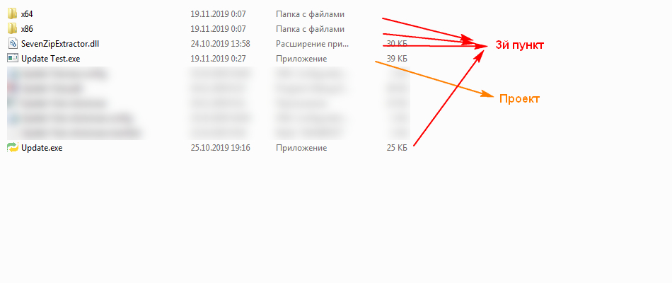

# Модуль для обновления софта.

Модуль обновления выглядит следующим образом


Какую информацию видит пользователь открыв окно:
* Новая версия
* Текущая версия вашего проекта
* Размер файла

Какие данные мы можем получить при добавление?
* Версию нашего проекта
* Версию проекта на сайте

Какие данные нужны для работы модуля:
1. Залить на хостинг следующие файлы:
* ***Version.txt*** - файл где находится версия проекта;
* ***Log.txt*** - информация об изменениях в новой версии;
* ***Soft.rar*** - ваше обновление;
2. Добавить [эту форму в свой проект](https://github.com/sashf1999/Update/tree/master/Update%20Test/Update), пример [можно увидеть тут](https://github.com/sashf1999/Update/blob/master/Update%20Test/Form1.cs). Мы должны указать ссылку на хостинг где уже должны находится файлы с 1го пункта.
```cs
private void button1_Click(object sender, EventArgs e){
    Update_Forms upForm = new Update_Forms("");//указать ссылку на хостинг
    if (upForm.CheckUpdateProj() )//Проверяем есть ли новое обновление
        upForm.ShowDialog();//Открывает форму
}
```
3. Скомпилировать [этот файл](https://github.com/sashf1999/Update/tree/master/Update%20Console) и поместить в папку с нашим проектом а так же 
```dll
SevenZipExtractor.dll
x32
x64
```
Они нам нужны для того что б разархивировать наш .rar файл в котором наше обновление. 
Если все правильно сделали то должно быть все примерно следующим образом 


## Как изменить какие либо данные?
**1. Изменить название файлов?** В форме есть 3 переменных, в них мы и меняем название нужных нам файлов
```cs
private string NameVersion = "Version.txt", 
NameLog = "Log.txt", 
NameSoft = "Soft.rar";
```
**2. Изменить версию проекта?** 


## Как все работает?
В форме которую мы с вами добавляем, указывая ссылка на хостинг, программа получает путь к нашим файлам, и текущие данные программы с данными на хостинге. 
* ***Version.txt*** - файл где находится версия проекта;
* ***Log.txt*** - информация об изменениях в новой версии;
* ***Soft.rar*** - ваше обновление;

Если наши данные разные, открывается окно и мы можем по желанию установить новое обновления или закрыть окно. Если мы с вами жмем загрузить обновление, программа скачивает ваш .rar файл и запускает Update.exe. Он в свою очередь разархивирует .rar файл, удаляет его и запускает уже новую версию программы
